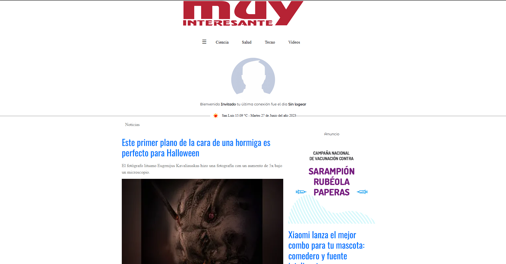
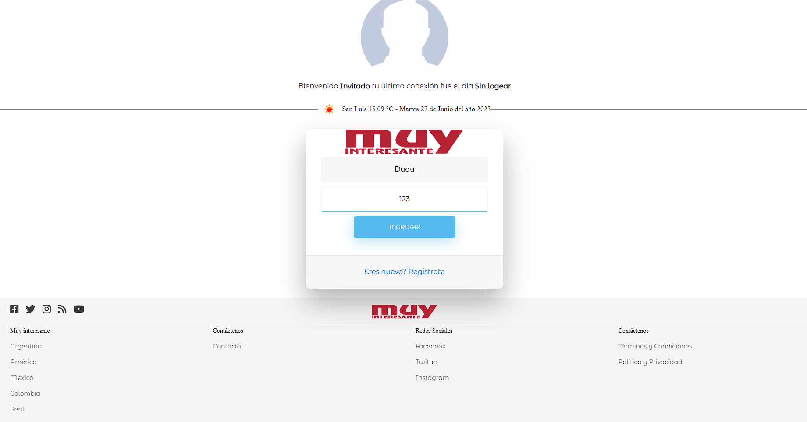
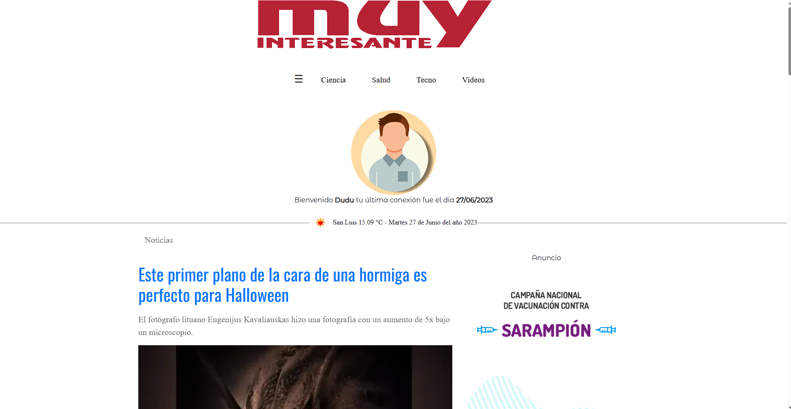
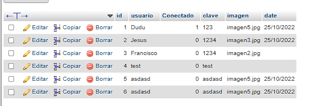
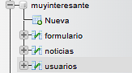

# MuyInteresante

MuyInteresante es una página web de noticias que te mantiene al día en temas de ciencia, salud, tecnología, videos y más. Aquí encontrarás artículos interesantes y actualizados sobre los temas que te importan. Este proyecto se realiza utilizando las tecnologías Spring Boot 4, HTML y Bootstrap, y se conecta a una base de datos SQL.

Realizada para una empresa de Tecnologia y Finanzas, llamada Beclever.
Es un API-REST Básico.

## Tecnologías utilizadas

- Spring Boot 4
- HTML
- Bootstrap
- Base de datos SQL

## Funcionalidades

- Inicio de sesión
- Desconexión
- Ciencia
- Salud
- Tecnología
- Videos
- Búsqueda
- Contacto

## Capturas de pantalla

Aquí puedes ver algunas capturas de pantalla de la página:

